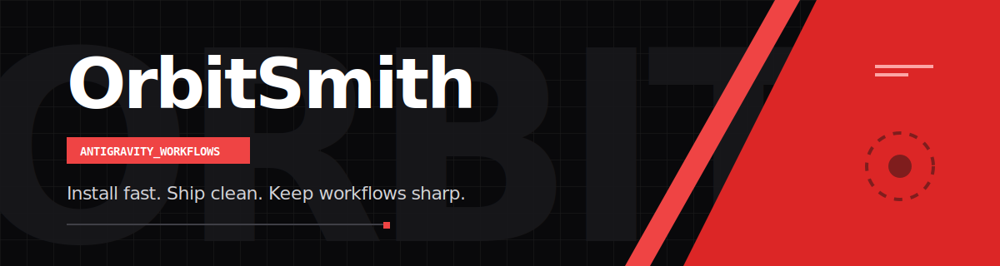

<p align="center">
  
</p>

<h1 align="center">OrbitSmith 🛰️</h1>
<p align="center"><b>Antigravity-focused Rust toolkit (v0.9.1 beta)</b> for clean, fast, multi-platform workflows.</p>

<p align="center">
  
  
  
  
</p>

---

## ⚡ Install

OrbitSmith provides pre-compiled binaries for **Windows** and **Linux** (v0.9.1 beta).

### Linux (Ubuntu/Debian)

```bash
curl -LO https://github.com/zhugez/orbitsmith/releases/download/v0.9.1-beta/orbitsmith-linux-x86_64
chmod +x orbitsmith-linux-x86_64
sudo mv orbitsmith-linux-x86_64 /usr/local/bin/orbitsmith
orbitsmith --help
```

### Windows (PowerShell)

```powershell
Invoke-WebRequest -Uri "https://github.com/zhugez/orbitsmith/releases/download/v0.9.1-beta/orbitsmith-windows-x86_64.exe" -OutFile "orbitsmith.exe"
# Move orbitsmith.exe to a directory in your PATH
.\orbitsmith.exe --help
```

---

## 🚀 Quick start

```bash
mkdir my-project && cd my-project
orbitsmith init
orbitsmith sync-skills
orbitsmith doctor
```

---

## 🧰 Commands

- `orbitsmith init` — initialize workspace
- `orbitsmith sync-skills` — sync skills from bundled kit
- `orbitsmith doctor` — verify local prerequisites
- `orbitsmith update` — pull latest OrbitSmith changes

---

## 📦 What’s inside

```text
orbitsmith/
├─ src/             # Rust CLI source
├─ bin/             # launcher/wrapper
├─ install/         # installers and bootstrap
├─ kit/             # canonical Antigravity-focused kit
├─ docs/            # quickstart + install docs
└─ assets/          # branding assets
```

---

## 🤝 Open Source

- [License](LICENSE)
- [Contributing](CONTRIBUTING.md)
- [Changelog](CHANGELOG.md)

**Scope:** OrbitSmith currently focuses on **Antigravity workflows only**.
